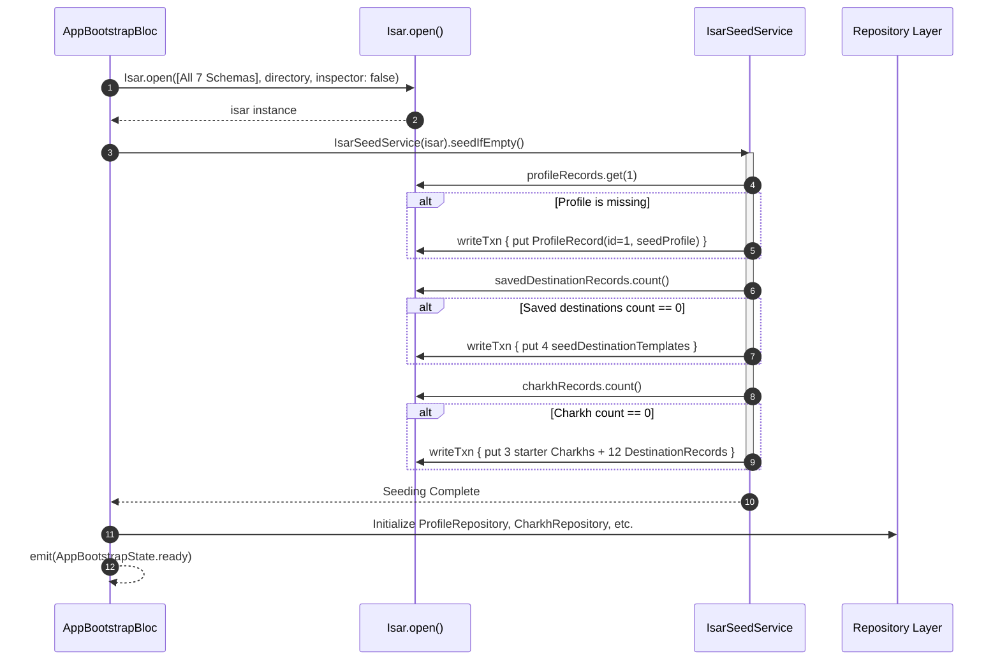

# Data Persistence, Isar Schemas & Cascade Invariants Architecture

This document provides dense, exact, agent-facing technical documentation for KosCharkh's local database layer, persistence topology, entity relationships, cascade deletion invariants, singleton session lifecycles, and code generation rules.

This specification is normative for any AI coding agent modifying, extending, debugging, or refactoring persistence code in this repository.

---

## 1. Persistence Topology & Architectural Philosophy

KosCharkh utilizes an embedded, zero-network, ACID-compliant local database powered by [**Isar**](https://isar.dev) (`package:isar/isar.dart`). The storage architecture adheres to Clean Architecture principles, enforcing complete decoupling between low-level persistence records and high-level domain entities.

### Core Architectural Decisions

1. **No `IsarLink` / `IsarLinks` Relations**:
   KosCharkh **MUST NOT** use Isar's built-in relation wrappers (`IsarLink<T>` or `IsarLinks<T>`).
   - **Domain Decoupling**: Domain models ([`Charkh`](../../lib/src/features/charkhs/domain/charkh.dart), [`Destination`](../../lib/src/features/destinations/domain/destination.dart), [`Profile`](../../lib/src/features/profile/domain/profile.dart)) remain pure Dart classes with zero imports from `package:isar/isar.dart`.
   - **Elimination of Asynchronous Lazy-Loading Pitfalls**: `IsarLink` relies on asynchronous loading (`await link.load()`) or synchronous access (`link.value`), which introduces race conditions, state tearing during widget rebuilds, and detached entity exceptions when accessed outside active database scopes.
   - **Snapshot Immutability & Equatable**: Domain entities are immutable and extend `Equatable`. Pure snapshots can be safely passed across BLoC streams, worker isolates, and UI widget trees without lazy-loading side effects or proxy mutation.
   - **Deterministic Cascades**: Relations are managed explicitly via indexed UUID business foreign keys (`charkhStableId`) within atomic transactions (`writeTxn`).

2. **Strict Separation: Record DTOs vs. Domain Entities**:
   Storage classes defined in [`lib/src/core/storage/entities.dart`](../../lib/src/core/storage/entities.dart) (`*Record`) are lightweight Data Transfer Objects representing physical Isar B-Tree tables. Feature repositories ([`CharkhRepository`](../../lib/src/features/charkhs/data/charkh_repository.dart), [`DestinationLibraryRepository`](../../lib/src/features/destinations/data/destination_library_repository.dart), [`ProfileRepository`](../../lib/src/features/profile/data/profile_repository.dart), [`RouteCacheRepository`](../../lib/src/features/routes/data/route_cache_repository.dart), [`ActiveRouteRepository`](../../lib/src/features/routes/data/active_route_repository.dart), [`CharkhHistoryRepository`](../../lib/src/features/routes/data/charkh_history_repository.dart)) encapsulate bidirectional mapping between `*Record` and pure domain entities.

3. **Dual Keying Strategy (Fast B-Tree ID vs. Global Business UUID)**:
   Every collection uses:
   - **Internal Isar `Id id`**: Fast 64-bit integer primary key used internally by Isar for B-Tree indexing.
   - **Business Key `@Index(unique: true, replace: true) String stableId`**: Standardized UUIDv4 string used for all cross-collection references, domain identity, and idempotent upserts via `putByStableId(...)`. Internal integer IDs **MUST NOT** be used as foreign keys.

---

## 2. Complete Entity Schema Catalog

All physical schemas are declared in [`lib/src/core/storage/entities.dart`](../../lib/src/core/storage/entities.dart) and compiled into [`lib/src/core/storage/entities.g.dart`](../../lib/src/core/storage/entities.g.dart).

```
+----------------------------------------------------------------------------------------------------+
|                                    Isar Storage Collections                                        |
+--------------------------+----------------------------------+--------------------------------------+
| Collection Class         | Primary Key Strategy             | Unique Index / Foreign Key           |
+--------------------------+----------------------------------+--------------------------------------+
| ProfileRecord            | Id id = 1 (Fixed Singleton)      | None (Row 1 is the profile)          |
| CharkhRecord             | Id id = Isar.autoIncrement       | @Index(unique: true) stableId        |
| DestinationRecord        | Id id = Isar.autoIncrement       | @Index(unique: true) stableId        |
|                          |                                  | @Index() charkhStableId              |
| SavedDestinationRecord   | Id id = Isar.autoIncrement       | @Index(unique: true) stableId        |
| RouteCacheRecord         | Id id = Isar.autoIncrement       | @Index(unique: true) charkhStableId  |
| ActiveRouteRecord        | Id id = 1 (Fixed Singleton)      | None (Row 1 is the active session)   |
| CharkhHistoryRecord      | Id id = Isar.autoIncrement       | @Index(unique: true) stableId        |
|                          |                                  | @Index() charkhStableId              |
+--------------------------+----------------------------------+--------------------------------------+
```

### 2.1 `ProfileRecord` (User Profile Singleton)
Persists the local user's personal profile information. KosCharkh is a single-tenant application; exactly one profile record exists.
- **Source**: [`ProfileRecord`](../../lib/src/core/storage/entities.dart#L6-L11)
- **Fields**:
  - `Id id = 1`: **Fixed singleton primary key**. Developers **MUST NOT** assign `Isar.autoIncrement`.
  - `String firstName = ''`: User's given name.
  - `String lastName = ''`: User's family name.
  - `String age = ''`: User's age as a string value.

### 2.2 `CharkhRecord` (Walking Route Definition)
Represents the header metadata for a user walking route ("Charkh").
- **Source**: [`CharkhRecord`](../../lib/src/core/storage/entities.dart#L14-L25)
- **Fields**:
  - `Id id = Isar.autoIncrement`: Fast internal 64-bit integer identifier.
  - `@Index(unique: true, replace: true) late String stableId`: Globally unique business key (e.g., `'charkh-1'` or UUIDv4).
  - `late String name`: Display title of the Charkh (e.g., `'First Charkh'`).
  - `int timeMinutes = 0`: Planned total walking duration target in minutes.
  - `String? description`: Optional long-form markdown/text description.
  - `late DateTime createdAt`: Timestamp of initial entity creation.
  - `late DateTime updatedAt`: Timestamp of last metadata or waypoint mutation.

### 2.3 `DestinationRecord` (Route-Bound Waypoint)
Represents an ordered waypoint belonging strictly to a parent Charkh.
- **Source**: [`DestinationRecord`](../../lib/src/core/storage/entities.dart#L28-L43)
- **Fields**:
  - `Id id = Isar.autoIncrement`: Fast internal 64-bit integer identifier.
  - `@Index(unique: true, replace: true) late String stableId`: Globally unique waypoint key (`'$charkhStableId-$templateStableId'` or UUIDv4).
  - `@Index() late String charkhStableId`: Foreign key pointing to the owning [`CharkhRecord.stableId`](../../lib/src/core/storage/entities.dart#L18). Indexed for fast collection-wide joins and cascade deletions.
  - `int position = 0`: 0-indexed ordinal sequence number ($0, 1, 2, \dots, N-1$). Dictates pedestrian navigation order.
  - `late String name`: Waypoint name or label.
  - `late String description`: Contextual waypoint note.
  - `double? latitude`: WGS-84 decimal latitude (null if unresolved address).
  - `double? longitude`: WGS-84 decimal longitude (null if unresolved address).
  - `String? address`: Human-readable reverse-geocoded street address or POI identifier.

### 2.4 `SavedDestinationRecord` (Reusable Destination Library)
Represents a saved point of interest in the user's personal bookmark library.
- **Source**: [`SavedDestinationRecord`](../../lib/src/core/storage/entities.dart#L46-L59)
- **Fields**:
  - `Id id = Isar.autoIncrement`: Fast internal 64-bit integer identifier.
  - `@Index(unique: true, replace: true) late String stableId`: Bookmark unique identifier.
  - `late String name`: Bookmark title.
  - `late String description`: Bookmark description.
  - `double? latitude`: WGS-84 decimal latitude.
  - `double? longitude`: WGS-84 decimal longitude.
  - `String? address`: Human-readable address.
  - `late DateTime createdAt`: Creation timestamp.
  - `late DateTime updatedAt`: Modification timestamp.

> [!IMPORTANT]
> **Architectural Distinction: `SavedDestinationRecord` vs. `DestinationRecord`**
> - `SavedDestinationRecord` is an **independent, reusable library item** unattached to any route. Deleting or editing a saved destination does NOT affect existing routes. Inserting a saved destination executes deduplication checks against existing library entries (`_matches`).
> - `DestinationRecord` is **strictly bound to a specific Charkh** via `charkhStableId` and ordered by `position`. When a Charkh is deleted, all its `DestinationRecord` rows **MUST** be deleted in the same transaction.

### 2.5 `RouteCacheRecord` (Calculated Polyline & Metrics Cache)
Caches pedestrian directions, polyline coordinates, and estimated metrics calculated from the Mapbox Directions API or fallback line generator.
- **Source**: [`RouteCacheRecord`](../../lib/src/core/storage/entities.dart#L62-L74)
- **Fields**:
  - `Id id = Isar.autoIncrement`: Fast internal 64-bit integer identifier.
  - `@Index(unique: true, replace: true) late String charkhStableId`: Business key enforcing a strict $1 \rightarrow 1$ cache relationship with [`CharkhRecord.stableId`](../../lib/src/core/storage/entities.dart#L18).
  - `List<double> latitudes = []`: Serialized primitive array of polyline latitude coordinates.
  - `List<double> longitudes = []`: Serialized primitive array of polyline longitude coordinates.
  - `double distanceMeters = 0`: Total calculated pedestrian path distance in meters.
  - `int durationSeconds = 0`: Estimated walking duration in seconds.
  - `late String source`: Provenance flag (`'mapbox'` for Directions API v5 or `'fallback'` for equirectangular straight-line legs).
  - `late DateTime updatedAt`: Cache generation timestamp.

### 2.6 `ActiveRouteRecord` (Live Navigation Session Singleton)
Tracks the in-flight state of the active walking navigation session.
- **Source**: [`ActiveRouteRecord`](../../lib/src/core/storage/entities.dart#L77-L84)
- **Fields**:
  - `Id id = 1`: **Fixed singleton primary key**. KosCharkh permits at most one concurrent active route session.
  - `late String charkhStableId`: Business key referencing the currently active Charkh.
  - `late DateTime startedAt`: Timestamp when the user engaged navigation.
  - `int elapsedSeconds = 0`: Total elapsed active session time.
  - `int etaSeconds = 0`: Remaining target countdown seconds.
  - `int currentDestinationIndex = 0`: 0-indexed pointer to the currently targeted waypoint in the route's destination list.

### 2.7 `CharkhHistoryRecord` (Completed Route Audit Trail)
An immutable historical audit record created when a walking route is completed or terminated.
- **Source**: [`CharkhHistoryRecord`](../../lib/src/core/storage/entities.dart#L87-L104)
- **Fields**:
  - `Id id = Isar.autoIncrement`: Fast internal 64-bit integer identifier.
  - `@Index(unique: true, replace: true) late String stableId`: Unique execution ID (`'history-${uuid.v4()}'`).
  - `@Index() late String charkhStableId`: Foreign key reference to the original Charkh.
  - `late String charkhName`: Snapshot of Charkh name at time of completion.
  - `late String userName`: Snapshot of user's display name (`ProfileRecord.firstName`).
  - `late DateTime startedAt`: Session start timestamp.
  - `late DateTime completedAt`: Session completion timestamp.
  - `int elapsedSeconds = 0`: Total duration walked in seconds.
  - `int etaSeconds = 0`: Target duration in seconds.
  - `int destinationCount = 0`: Total waypoints completed.
  - `String? finalDestinationName`: Label of the terminal destination.

---

## 3. Entity Relationship & Keying Strategy

```
                                +---------------------------+
                                |       ProfileRecord       |
                                |       (Singleton id=1)    |
                                +---------------------------+

                                +---------------------------+
                                |  SavedDestinationRecord   |
                                |     (User POI Library)    |
                                +-------------+-------------+
                                              | (Templates / Clones)
                                              v
+-----------------------+ 1:N   +---------------------------+
|      CharkhRecord     +------>|     DestinationRecord     |
| (stableId = "charkh-*)|       | (charkhStableId, position)|
+-----------+-----------+       +---------------------------+
            |
            | 1:1
            v
+---------------------------+
|     RouteCacheRecord      |
| (charkhStableId = unique) |
+---------------------------+
            |
            | References active
            v
+---------------------------+   1:N Audit   +---------------------------+
|     ActiveRouteRecord     |-------------->|    CharkhHistoryRecord    |
|      (Singleton id=1)     |               | (charkhStableId, history) |
+---------------------------+               +---------------------------+
```

### Entity Relationship Diagram (Mermaid)

```mermaid
erDiagram
    ProfileRecord {
        int id PK "Fixed: 1"
        string firstName
        string lastName
        string age
    }

    CharkhRecord {
        int id PK "Auto-increment"
        string stableId UK "Indexed unique"
        string name
        int timeMinutes
        string description
        datetime createdAt
        datetime updatedAt
    }

    DestinationRecord {
        int id PK "Auto-increment"
        string stableId UK "Indexed unique"
        string charkhStableId FK "Indexed foreign key"
        int position "0-indexed sequence"
        string name
        string description
        double latitude
        double longitude
        string address
    }

    SavedDestinationRecord {
        int id PK "Auto-increment"
        string stableId UK "Indexed unique"
        string name
        string description
        double latitude
        double longitude
        string address
        datetime createdAt
        datetime updatedAt
    }

    RouteCacheRecord {
        int id PK "Auto-increment"
        string charkhStableId UK "Indexed unique 1:1"
        double_list latitudes
        double_list longitudes
        double distanceMeters
        int durationSeconds
        string source
        datetime updatedAt
    }

    ActiveRouteRecord {
        int id PK "Fixed: 1"
        string charkhStableId FK "Active Charkh reference"
        datetime startedAt
        int elapsedSeconds
        int etaSeconds
        int currentDestinationIndex
    }

    CharkhHistoryRecord {
        int id PK "Auto-increment"
        string stableId UK "Indexed unique"
        string charkhStableId FK "Indexed foreign key"
        string charkhName
        string userName
        datetime startedAt
        datetime completedAt
        int elapsedSeconds
        int etaSeconds
        int destinationCount
        string finalDestinationName
    }

    CharkhRecord ||--o{ DestinationRecord : "owns (1:N)"
    CharkhRecord ||--o| RouteCacheRecord : "caches (1:1)"
    CharkhRecord ||--o| ActiveRouteRecord : "current session"
    CharkhRecord ||--o{ CharkhHistoryRecord : "audit history (1:N)"
    SavedDestinationRecord ..o{ DestinationRecord : "clones template to"
```

### Keying Strategy Invariants

1. **Foreign Keys MUST Use `stableId`**:
   Cross-collection references (`charkhStableId`) **MUST** match the target entity's `stableId` (`String`). Developers **MUST NOT** store or reference internal Isar integer `id` values across collections. Internal integer IDs are volatile across database restores, migrations, and test environments.
2. **Upsert via `putByStableId`**:
   Because `stableId` is decorated with `@Index(unique: true, replace: true)`, Isar automatically generates `putByStableId(...)`. This performs an atomic insert-or-replace without requiring prior lookups.
3. **Singleton Identity Enforcement**:
   Both `ProfileRecord` and `ActiveRouteRecord` **MUST** explicitly assign `record.id = 1`. Calling `isar.collection.put(record)` with `id = 1` guarantees that existing singletons are updated in place and no duplicate rows are created.

---

## 4. Cascade Invariants & Transaction Patterns

Isar executes writes inside atomic transaction blocks: `await isar.writeTxn(() async { ... })`. If an uncaught exception occurs within the callback, the entire transaction rolls back cleanly.

KosCharkh enforces three mandatory cascade patterns in repository code:

### 4.1 Save Charkh Mutation (Wipe-and-Replace Destination Indexing)
When calling [`CharkhRepository.saveCharkh(Charkh charkh)`](../../lib/src/features/charkhs/data/charkh_repository.dart#L31-L62), destinations **MUST** be completely replaced and re-indexed to prevent gaps, duplicates, or stale coordinates:

```
[saveCharkh Invoked]
       |
       +---> 1. Fetch existing DestinationRecord entries where charkhStableId == charkh.stableId
       |
       +---> 2. Enter isar.writeTxn:
                  |-- a. Upsert CharkhRecord via putByStableId
                  |-- b. Delete ALL existing DestinationRecord IDs via deleteAll()
                  |-- c. Iterate charkh.destinations and insert DestinationRecord entries:
                           - Assign destination.position = index (0, 1, 2, ...)
                           - Assign stableId and charkhStableId
                           - Put via destinationRecords.putByStableId()
```

### 4.2 Delete Charkh Cascade Matrix
When calling [`CharkhRepository.deleteCharkh(String stableId)`](../../lib/src/features/charkhs/data/charkh_repository.dart#L64-L73), the transaction **MUST** atomically purge all child dependencies across three collections:

```dart
// Mandatory Cascade Implementation in CharkhRepository
Future<void> deleteCharkh(String stableId) async {
  final destinationRecords = await _destinationRecordsFor(stableId);
  await _isar.writeTxn(() async {
    // 1. Delete parent CharkhRecord
    await _isar.charkhRecords.deleteByStableId(stableId);

    // 2. Cascade delete all child DestinationRecord entries
    await _isar.destinationRecords.deleteAll(
      destinationRecords.map((item) => item.id).toList(),
    );

    // 3. Cascade delete associated RouteCacheRecord
    await _isar.routeCacheRecords.deleteByCharkhStableId(stableId);
  });
}
```

> [!CAUTION]
> **Orphan Record Prevention**:
> Omitting step 2 leaves orphan `DestinationRecord` entries that consume storage and leak into unindexed queries. Omitting step 3 leaves stale polylines in `RouteCacheRecord`, causing subsequent Charkhs reusing the same ID or test harness to display incorrect polylines.
>
> **Historical Exemption**:
> `CharkhHistoryRecord` entries referencing `charkhStableId` are **NOT** deleted when a Charkh is deleted. Historical records constitute an immutable audit log of completed walking sessions.

### 4.3 Active Route Session Lifecycle
[`ActiveRouteRepository`](../../lib/src/features/routes/data/active_route_repository.dart#L5-L36) manages the active navigation state using fixed singleton `id = 1`:
- **Save Active Route**:
  ```dart
  Future<void> saveActiveRoute({
    required String charkhStableId,
    required DateTime startedAt,
    required int elapsedSeconds,
    required int etaSeconds,
    required int currentDestinationIndex,
  }) async {
    await _isar.writeTxn(() async {
      final record = (await _isar.activeRouteRecords.get(1)) ?? ActiveRouteRecord();
      record
        ..id = 1 // MANDATORY: Enforce singleton ID
        ..charkhStableId = charkhStableId
        ..startedAt = startedAt
        ..elapsedSeconds = elapsedSeconds
        ..etaSeconds = etaSeconds
        ..currentDestinationIndex = currentDestinationIndex;
      await _isar.activeRouteRecords.put(record);
    });
  }
  ```
- **Clear Active Route**:
  ```dart
  Future<void> clearActiveRoute() async {
    await _isar.writeTxn(() async {
      await _isar.activeRouteRecords.delete(1);
    });
  }
  ```
- Auto-incrementing `ActiveRouteRecord` is strictly prohibited. There **MUST NEVER** be more than one active route row in the database.

---

## 5. Seeding & Database Bootstrap Lifecycle

Database initialization occurs during the execution of [`AppBootstrapBloc._onStarted`](../../lib/src/core/app/app_bootstrap_bloc.dart#L58-L96) prior to UI routing and widget tree mounting.



### Seeding Invariants

1. **Idempotency Guard**:
   [`IsarSeedService.seedIfEmpty()`](../../lib/src/core/storage/isar_seed_service.dart#L11-L50) checks existence before executing write transactions:
   - `_seedProfileIfEmpty()`: Checks `await _isar.profileRecords.get(1) != null`.
   - `_seedSavedDestinationsIfEmpty()`: Checks `await _isar.savedDestinationRecords.count() > 0`.
   - Starter Charkhs: Checks `await _isar.charkhRecords.count() > 0`.
2. **Deterministic Seed Content**:
   Defined in [`lib/src/core/storage/seed_data.dart`](../../lib/src/core/storage/seed_data.dart):
   - **Profile**: `firstName: 'realseyed'`, `lastName: ''`, `age: ''`.
   - **Saved Destination Templates**: 4 Manhattan landmarks in SoHo / Greenwich Village, NYC:
     - `dest-1`: `'First Destination'` ($40.7247^\circ\text{N}, -73.9970^\circ\text{W}$)
     - `dest-2`: `'Second Destination'` ($40.7270^\circ\text{N}, -73.9995^\circ\text{W}$)
     - `dest-3`: `'Third Destination'` ($40.7304^\circ\text{N}, -74.0022^\circ\text{W}$)
     - `dest-4`: `'Fourth Destination'` ($40.7315^\circ\text{N}, -73.9942^\circ\text{W}$)
   - **Starter Charkhs**: 3 starter Charkhs (`'charkh-1'`, `'charkh-2'`, `'charkh-3'`), 20 minutes each, with 4 waypoints each mapped sequentially with positions `0, 1, 2, 3`.

---

## 6. Build Runner & Code Generation Workflow

Isar requires static code generation to produce schema definitions (`*RecordSchema`) and type-safe query extensions.

### Schema Modification Protocol

Whenever [`lib/src/core/storage/entities.dart`](../../lib/src/core/storage/entities.dart) is modified:

1. **Execute Code Generation**:
   ```bash
   dart run build_runner build --delete-conflicting-outputs
   ```
2. **Analysis Options Exclusion**:
   [`analysis_options.yaml`](../../analysis_options.yaml#L12-L17) explicitly excludes all generated files from lint analysis:
   ```yaml
   analyzer:
     exclude:
       - "**/*.g.dart"
       - build/**
       - android/**
       - ios/**
   ```
3. **Commit Requirement**:
   Both `lib/src/core/storage/entities.dart` and the generated `lib/src/core/storage/entities.g.dart` **MUST** be committed together in the same git commit. Never commit schema changes without updating the generated file.
