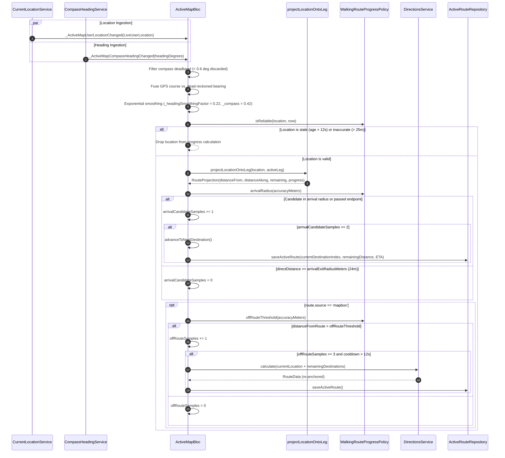

# Navigation and Sensor Engine Architecture

This document provides dense, mathematically exact, agent-facing technical documentation for KosCharkh's navigation and sensor engine. It details the active navigation state machine, dual-sensor fusion algorithms, local tangent plane Cartesian leg projections, geofencing hysteresis, dynamic rerouting mechanics, and persistence lifecycles.

This specification is normative for any AI coding agent extending, debugging, or refactoring route navigation in this repository.

---

## 1. Architectural Role & Overview

The navigation subsystem is orchestrated by [`ActiveMapBloc`](file:///f:/dev/koscharkh/lib/src/features/routes/application/active_route_bloc.dart#L352-L1104). It acts as the single source of truth for active route tracking, coordinating sensory streams, spatial projection mathematics, camera following modes, arrival state machines, and local persistence.

```
+---------------------------------------------------------------------------------------------------+
|                                          ActiveMapBloc                                            |
|                                                                                                   |
|  +-----------------------------+   +-----------------------------+   +-------------------------+  |
|  |    CurrentLocationService   |   |    CompassHeadingService    |   |    1 Hz Periodic Timer  |  |
|  | (Geolocator GPS Stream @2m) |   |  (Magnetometer Azimuth Stream)| |   (Elapsed & Countdown) |  |
|  +--------------+--------------+   +--------------+--------------+   +------------+------------+  |
|                 |                                 |                               |               |
|                 v                                 v                               v               |
|  _ActiveMapUserLocationChanged       _ActiveMapCompassHeadingChanged        ActiveMapTicked       |
|                 |                                 |                               |               |
|                 +---------------+-----------------+                               |               |
|                                 |                                                 |               |
|                                 v                                                 v               |
|                 +-------------------------------+                 +----------------------------+  |
|                 | Sensor Fusion & Heading Logic |                 | 5s Throttle / Countdown    |  |
|                 | (Course / Bearing / Smoothing)|                 | State Machine Evaluator    |  |
|                 +---------------+---------------+                 +-------------+--------------+  |
|                                 |                                               |                 |
|                                 v                                               v                 |
|                 +-------------------------------+                 +----------------------------+  |
|                 |   Reliability Filter & Gate   |                 |    ActiveRouteRepository   |  |
|                 |   (Accuracy <=25m, Age <=12s) |                 |    (Isar Record ID = 1)    |  |
|                 +---------------+---------------+                 +----------------------------+  |
|                                 |                                                                 |
|                                 v                                                                 |
|                 +-------------------------------+                                                 |
|                 |     projectLocationOntoLeg    |                                                 |
|                 |  (Local Tangent Plane Meters) |                                                 |
|                 +---------------+---------------+                                                 |
|                                 |                                                                 |
|                                 v                                                                 |
|                 +-------------------------------+                                                 |
|                 |   WalkingRouteProgressPolicy  |                                                 |
|                 |  (Dynamic Radius, Hysteresis) |                                                 |
|                 +-------+---------------+-------+                                                 |
|                         |               |                                                         |
|             +-----------+               +-----------+                                             |
|             v                                       v                                             |
|     Waypoint Arrival                         Off-Route Excursion                                  |
|    (Samples >= 2 -> Next)                   (Samples >= 3 -> Reroute)                             |
|             |                                       |                                             |
|             v                                       v                                             |
|   _advanceToNextDestination                   _requestReroute                                     |
|             |                                       |                                             |
|             v                                       v                                             |
|   CharkhHistoryRepository                   DirectionsService                                     |
|    (Completion Record)                     (Mapbox API Recalculation)                             |
+---------------------------------------------------------------------------------------------------+
```

### Component Boundaries & Dependency Inversion

1. **[`CurrentLocationService`](file:///f:/dev/koscharkh/lib/src/features/locations/data/current_location_service.dart#L15-L80)**: Wraps `geolocator`. Emits raw [`LiveUserLocation`](file:///f:/dev/koscharkh/lib/src/features/locations/domain/live_user_location.dart#L5-L29) records configured with high accuracy (`LocationAccuracy.high`), a 12-second acquisition timeout, and a 2-meter spatial distance filter (`distanceFilter: 2`).
2. **[`CompassHeadingService`](file:///f:/dev/koscharkh/lib/src/features/locations/data/compass_heading_service.dart#L5-L20)**: Wraps `flutter_compass`. Emits raw device magnetometer headings normalized to $[0, 360)^\circ$.
3. **[`projectLocationOntoLeg`](file:///f:/dev/koscharkh/lib/src/features/routes/domain/walking_route_progress.dart#L73-L145)**: Pure, stateless mathematical transformation projecting WGS-84 coordinates onto a route polyline leg using an equirectangular local tangent plane approximation.
4. **[`WalkingRouteProgressPolicy`](file:///f:/dev/koscharkh/lib/src/features/routes/domain/walking_route_progress.dart#L32-L71)**: Authoritative boundary defining numerical validation rules, sample counters, arrival clamping, and off-route excursion limits.
5. **[`DirectionsService`](file:///f:/dev/koscharkh/lib/src/features/routes/data/directions_service.dart#L20-L59)**: Handles network requests to the Mapbox Directions API v5 (`mapbox/walking`) and generates proportional straight-line fallback routes via `buildFallbackRoute`.
6. **[`ActiveRouteRepository`](file:///f:/dev/koscharkh/lib/src/features/routes/data/active_route_repository.dart#L5-L36)**: Manages persistence of in-flight active route state into local Isar storage (`ActiveRouteRecord`, fixed singleton `id = 1`).
7. **[`CharkhHistoryRepository`](file:///f:/dev/koscharkh/lib/src/features/routes/data/charkh_history_repository.dart#L10-L62)**: Persists finalized route executions to local Isar storage upon user or countdown completion.

### Sequence Flow: Sensor Ingestion to State Persistence



---

## 2. Sensor Fusion & Heading Calculation

KosCharkh implements a hybrid sensor fusion scheme in [`ActiveMapBloc`](file:///f:/dev/koscharkh/lib/src/features/routes/application/active_route_bloc.dart#L1137-L1234) that arbitrates between GPS Doppler velocity course and dead-reckoned geographic azimuth, smoothed with an exponential low-pass filter.

### GPS Course vs. Magnetometer Heading Mechanics

GPS hardware heading reports instantaneous course over ground, but becomes erratic or completely undefined at pedestrian walking speeds or while stationary. KosCharkh enforces strict filtering:

```dart
// lib/src/features/routes/application/active_route_bloc.dart
const _minimumHeadingSpeedMetersPerSecond = 0.7;
const _minimumBearingDistanceMeters = 3.0;

bool _isUsableHeading(double? heading, double speedMetersPerSecond) {
  return heading != null &&
      heading.isFinite &&
      speedMetersPerSecond >= _minimumHeadingSpeedMetersPerSecond;
}
```

1. **Velocity Threshold**: GPS heading is deemed valid (`_isUsableHeading`) **if and only if**:
   - `heading != null`
   - `heading.isFinite`
   - `speedMetersPerSecond >= 0.7 m/s` ($\approx 2.52\,\text{km/h}$).
2. **Dead-Reckoned Bearing Fallback**: When GPS speed is $< 0.7\,\text{m/s}$ or GPS course is unavailable, [`_headingForLocation`](file:///f:/dev/koscharkh/lib/src/features/routes/application/active_route_bloc.dart#L1164-L1184) inspects spatial displacement from the previous recorded location:
   - If `previousCoordinates == null`, returns `null`.
   - Displacement is evaluated via Haversine distance:
     $$d = \text{distanceMeters}(\mathbf{x}_{t-1}, \mathbf{x}_t)$$
   - If $d < 3.0\,\text{m}$ (`_minimumBearingDistanceMeters`), returns `null`. This deadband suppresses false heading rotations caused by stationary GPS drift.
   - If $d \ge 3.0\,\text{m}$, the forward azimuth between the two consecutive WGS-84 fixes is computed.

### Forward Azimuth Formula

The forward bearing $\theta$ from coordinate $(\phi_1, \lambda_1)$ to $(\phi_2, \lambda_2)$ in radians is derived from spherical trigonometry:

$$\Delta \lambda = \lambda_2 - \lambda_1$$
$$y = \sin(\Delta \lambda) \cdot \cos(\phi_2)$$
$$x = \cos(\phi_1) \cdot \sin(\phi_2) - \sin(\phi_1) \cdot \cos(\phi_2) \cdot \cos(\Delta \lambda)$$
$$\theta = \text{atan2}(y, x)$$

Converting to degrees and normalizing to the half-open interval $[0, 360)^\circ$:

$$\theta_{\text{norm}} = \left(\left(\theta \times \frac{180}{\pi}\right) \pmod{360} + 360\right) \pmod{360}$$

Implemented in [`_bearingBetween`](file:///f:/dev/koscharkh/lib/src/features/routes/application/active_route_bloc.dart#L1205-L1213):
```dart
double _bearingBetween(Coordinates from, Coordinates to) {
  final fromLat = _degreesToRadians(from.latitude);
  final toLat = _degreesToRadians(to.latitude);
  final deltaLng = _degreesToRadians(to.longitude - from.longitude);
  final y = sin(deltaLng) * cos(toLat);
  final x = cos(fromLat) * sin(toLat) - sin(fromLat) * cos(toLat) * cos(deltaLng);
  return _normalizeDegrees(_radiansToDegrees(atan2(y, x)));
}
```

### Shortest-Angle Delta & Exponential Smoothing

To prevent camera and marker flickering when crossing the $0^\circ \leftrightarrow 360^\circ$ discontinuity (e.g., oscillating between $359^\circ$ and $1^\circ$), the angular difference is calculated via modular arithmetic:

$$\Delta\theta = ((to - from + 540) \pmod{360}) - 180$$

This yields a signed angular delta $\Delta\theta \in [-180, 180)^\circ$.

The heading is updated via an exponential single-pole low-pass filter:

$$\theta_{\text{smoothed}} = (from + \Delta\theta \times \alpha) \pmod{360}$$

KosCharkh configures two distinct smoothing factors ($\alpha$) in [`ActiveMapBloc`](file:///f:/dev/koscharkh/lib/src/features/routes/application/active_route_bloc.dart#L1139-L1141):

| Channel | Constant | Weight ($\alpha$) | Rationale |
|---|---|---|---|
| **GPS Course / Bearing** | `_headingSmoothingFactor` | `0.22` | Heavy smoothing. Filters out lateral pedestrian sway and intermittent multi-path GPS jumps while walking. |
| **Magnetometer Compass** | `_compassHeadingSmoothingFactor` | `0.42` | Moderate smoothing. Provides low-latency visual responsiveness when the user turns their body or phone. |

### Compass Deadband Filter

To eliminate micro-flutter caused by electronic device magnetometer noise while held stationary, [`_onCompassHeadingChanged`](file:///f:/dev/koscharkh/lib/src/features/routes/application/active_route_bloc.dart#L742-L765) applies a deadband threshold:

$$|\Delta\theta| < 0.6^\circ \quad (\text{`_minimumCompassHeadingDeltaDegrees`})$$

Any compass delta below $0.6^\circ$ is dropped immediately without updating `deviceHeadingDegrees` or `smoothedCameraHeadingDegrees`.

---

## 3. Cartesian Route Leg Projection (`projectLocationOntoLeg`)

High-rate perpendicular projection in WGS-84 spherical space is computationally heavy. KosCharkh implements a local tangent plane equirectangular approximation in [`projectLocationOntoLeg`](file:///f:/dev/koscharkh/lib/src/features/routes/domain/walking_route_progress.dart#L73-L145).

### Tangent Plane Coordinate Transformation

The origin $\mathbf{O} = (\phi_{\text{origin}}, \lambda_{\text{origin}})$ is anchored to the user's current coordinate. Every point $\mathbf{P} = (\phi, \lambda)$ along the route leg is mapped to Cartesian local tangent plane coordinates $(x, y)$ in meters:

$$\Delta \lambda = (\lambda - \lambda_{\text{origin}}) \times \frac{\pi}{180}, \quad \Delta \phi = (\phi - \phi_{\text{origin}}) \times \frac{\pi}{180}$$
$$x = \Delta \lambda \times \cos\left(\phi_{\text{origin}} \times \frac{\pi}{180}\right) \times R$$
$$y = \Delta \phi \times R$$

Where mean Earth radius $R = 6,371,000.0\,\text{m}$. In this reference frame, the user's location is mapped exactly to $(0, 0)$.

### Parametric Line Segment Projection

Each leg polyline consists of $M$ points defining $M-1$ segments. For segment $i$ between $\mathbf{s} = (x_i, y_i)$ and $\mathbf{e} = (x_{i+1}, y_{i+1})$:

1. **Segment Vector**:
   $$\mathbf{v} = \mathbf{e} - \mathbf{s} = (\Delta x, \Delta y) = (x_{i+1} - x_i, y_{i+1} - y_i)$$
   $$\|\mathbf{v}\|^2 = \Delta x^2 + \Delta y^2$$

2. **Vector from Start to User Origin**:
   Since the user is at $(0, 0)$, the vector from $\mathbf{s}$ to the user is $-\mathbf{s} = (-x_i, -y_i)$.

3. **Parametric Scalar $t$**:
   The scalar projection of $-\mathbf{s}$ onto $\mathbf{v}$, clamped to the segment endpoints $[0.0, 1.0]$:
   $$t = \begin{cases} 0.0, & \text{if } \|\mathbf{v}\|^2 = 0 \\ \text{clamp}\left(\frac{-x_i \Delta x - y_i \Delta y}{\Delta x^2 + \Delta y^2}, 0.0, 1.0\right), & \text{otherwise} \end{cases}$$

4. **Closest Point & Orthogonal Distance**:
   $$\mathbf{p} = \mathbf{s} + t \cdot \mathbf{v} = (x_i + t \Delta x, y_i + t \Delta y)$$
   $$d_{\text{segment}} = \|\mathbf{p}\| = \sqrt{p_x^2 + p_y^2}$$

5. **Traversed & Along Distance**:
   $$\text{alongSegment} = \|\mathbf{v}\| \times t$$
   $$\text{distanceAlongRouteMeters} = \text{traversedDistance}_{i-1} + \text{alongSegment}$$

6. **Leg Aggregation**:
   The segment yielding the minimum $d_{\text{segment}}$ across all $M-1$ segments is chosen as the candidate projection:
   $$d_{\text{closest}} = \min_{i} (d_{\text{segment}, i})$$
   $$\text{progress} = \begin{cases} 0.0, & \text{if } L_{\text{total}} \le 0 \\ \text{clamp}\left(\frac{\text{closestAlongDistance}}{L_{\text{total}}}, 0.0, 1.0\right), & \text{otherwise} \end{cases}$$
   $$\text{remainingRouteDistanceMeters} = \max(0, L_{\text{total}} - \text{closestAlongDistance})$$

### Edge Cases in Projection

- **Empty Points Polyline**: Returns `distanceFromRouteMeters = infinity`, `distanceAlongRouteMeters = 0`, `remainingRouteDistanceMeters = 0`, `progress = 0`.
- **Single Point Polyline**: Returns `distanceFromRouteMeters = distanceMeters(location, point)`, `distanceAlongRouteMeters = 0`, `remainingRouteDistanceMeters = distance`, `progress = 0`.
- **Zero-Length Segment** ($\mathbf{s} == \mathbf{e}$): Degenerate segment handles $\|\mathbf{v}\|^2 = 0$ by setting $t = 0.0$.

### Multi-Leg Route Progress (`_remainingRouteProgress`)

When navigating a multi-stop Charkh, the active leg's projection is composed with downstream legs in [`_remainingRouteProgress`](file:///f:/dev/koscharkh/lib/src/features/routes/application/active_route_bloc.dart#L1106-L1123):

$$f_{\text{rem}} = \text{clamp}(1.0 - \text{projection.progress}, 0.0, 1.0)$$
$$D_{\text{remaining}} = \left(\text{leg}_{\text{active}}.\text{distanceMeters} \times f_{\text{rem}}\right) + \sum_{k = \text{active} + 1}^{N-1} \text{leg}_k.\text{distanceMeters}$$
$$T_{\text{remaining}} = \text{round}\left(\text{leg}_{\text{active}}.\text{durationSeconds} \times f_{\text{rem}}\right) + \sum_{k = \text{active} + 1}^{N-1} \text{leg}_k.\text{durationSeconds}$$

---

## 4. Waypoint Arrival State Machine & Hysteresis

To prevent premature waypoint arrival or false-positive destination advancement in dense urban environments (urban canyons, multipath reflections), KosCharkh enforces strict multi-sample hysteresis.

```
                  +--------------------------------+
                  |    GPS Fix Ingested & Valid    |
                  +---------------+----------------+
                                  |
                                  v
                  +--------------------------------+
                  |  Direct Distance to Target     |
                  |  d = distanceMeters(pos, dest) |
                  +---------------+----------------+
                                  |
            +---------------------+---------------------+
            |                                           |
            v                                           v
[ d <= arrivalRadius(acc) ]             [ d >= arrivalExitRadiusMeters (24m) ]
           OR                                           |
[ remDist <= 5m AND d <= 22m ]                          v
            |                                  _arrivalCandidateSamples = 0
            v
  _arrivalCandidateSamples += 1
            |
            v
+-------------------------------+
| _arrivalCandidateSamples >= 2 |
+---------------+---------------+
                |
       +--------+--------+
       | YES             | NO
       v                 v
[ Advance Stop ]    [ Retain Index ]
```

### Location Reliability Filter

A GPS fix is rejected prior to arrival evaluation if it violates [`WalkingRouteProgressPolicy.isReliable`](file:///f:/dev/koscharkh/lib/src/features/routes/domain/walking_route_progress.dart#L47-L59):
- `!location.accuracyMeters.isFinite || location.accuracyMeters < 0`
- `location.accuracyMeters > 25.0 m` (`maximumReliableAccuracyMeters`)
- $|t_{\text{now}} - t_{\text{sample}}| > 12\,\text{s}$ (`maximumLocationAge`)

Additionally, duplicate timestamp fixes (`location.timestamp == _lastProgressSampleAt`) are dropped immediately.

### Dynamic Arrival Radius

Pedestrian arrival tolerance dynamically scales with the GPS receiver's reported horizontal accuracy:

$$r_{\text{arr}} = \text{clamp}(\text{accuracyMeters} \times 1.2, 12.0\,\text{m}, 18.0\,\text{m})$$

- At high GPS accuracy ($3.0\,\text{m}$), $r_{\text{arr}} = 12.0\,\text{m}$.
- At degraded GPS accuracy ($20.0\,\text{m}$), $r_{\text{arr}} = 18.0\,\text{m}$.

### Endpoint Pass Detection

Pedestrians frequently walk past a destination without stepping directly onto its mapped coordinate (e.g., walking on the opposite side of a wide street or turning a corner). KosCharkh flags an arrival candidate if:

$$\text{projection.remainingRouteDistanceMeters} \le 5.0\,\text{m} \quad (\text{`endpointRemainingDistanceMeters`})$$
$$\land \quad d_{\text{direct}} \le 22.0\,\text{m} \quad (\text{`endpointPassRadiusMeters`})$$

### Sample Hysteresis & State Transition

1. **Candidate Verification**: An arrival candidate must persist across **2 consecutive valid samples** (`arrivalConfirmationSamples = 2`).
2. **Hysteresis Exit Boundary**: If the direct distance to the destination increases to $d_{\text{direct}} \ge 24.0\,\text{m}$ (`arrivalExitRadiusMeters`), `_arrivalCandidateSamples` is immediately reset to `0`.
3. **Advancement Execution** ([`_advanceToNextDestination`](file:///f:/dev/koscharkh/lib/src/features/routes/application/active_route_bloc.dart#L902-L952)):
   - Resets `_arrivalCandidateSamples = 0` and `_offRouteSamples = 0`.
   - Increments `currentDestinationIndex += 1`.
   - If `currentDestinationIndex >= destinations.length`:
     - Sets `finishStatus = ActiveMapFinishStatus.prompting`.
     - Initiates auto-finish countdown: `finishCountdownSeconds = 10`.
     - Forces `panelState = ActiveMapPanelState.expanded`.
     - Persists completed state immediately to Isar.
   - If subsequent destinations remain:
     - Calculates active leg index: `nextLegIndex = nextIndex - routeStartDestinationIndex`.
     - Sums downstream leg distances and durations.
     - Recomputes `distanceToNextDestinationMeters = distanceMeters(userLocation, destinations[nextIndex].coordinates)`.
     - Clears `isOffRoute = false`.
     - Persists updated state immediately to Isar.

---

## 5. Off-Route Detection & Auto-Reroute Mechanics

### Conditioning & Suppression

Off-route detection is strictly enabled **only for Mapbox-sourced routes**:

```dart
// lib/src/features/routes/application/active_route_bloc.dart
if (route.source != 'mapbox') {
  _offRouteSamples = 0;
  emit(progressState.copyWith(isOffRoute: false, navigationMessage: null));
  return;
}
```

Fallback routes (`route.source == 'fallback'`) lack turn-by-turn road network geometry; evaluating off-route excursions against straight-line segments would induce false rerouting loops.

### Dynamic Off-Route Threshold

The spatial divergence threshold accounts for degraded GPS precision:

$$d_{\text{off}} = \max(30.0\,\text{m}, \text{accuracyMeters} \times 1.5)$$

Where base distance is `offRouteDistanceMeters = 30.0 m`.

### Confirmation Hysteresis

- If $\text{projection.distanceFromRouteMeters} > d_{\text{off}}$:
  $$\text{\_offRouteSamples} \leftarrow \text{\_offRouteSamples} + 1$$
- Else:
  $$\text{\_offRouteSamples} \leftarrow 0$$
  If previously flagged `isOffRoute == true` and not rerouting, clears `isOffRoute` to `false`.

An off-route state is declared **only when $\text{\_offRouteSamples} \ge 3$** (`offRouteConfirmationSamples = 3`).

### Reroute Cooldown & Concurrency Guard

When 3 consecutive off-route samples are confirmed, [`_requestReroute`](file:///f:/dev/koscharkh/lib/src/features/routes/application/active_route_bloc.dart#L954-L970) enforces two rate-limiting constraints:
1. **Concurrency Mutex**: `_isRerouting` boolean guard prevents concurrent asynchronous requests.
2. **Temporal Cooldown**: Reroute is rejected if:
   $$t_{\text{now}} - t_{\text{lastReroute}} < 12\,\text{s} \quad (\text{`WalkingRouteProgressPolicy.rerouteCooldown`})$$

### Leg Re-Anchoring Logic

When a reroute request succeeds ([`_onRerouteRequested`](file:///f:/dev/koscharkh/lib/src/features/routes/application/active_route_bloc.dart#L972-L1028)):
1. The new route is calculated starting from the pedestrian's instantaneous location $\mathbf{x}_{\text{user}}$ to all remaining unvisited destinations:
   $$\text{Coordinates} = [\mathbf{x}_{\text{user}}, \mathbf{D}_{\text{destIndex}}, \mathbf{D}_{\text{destIndex}+1}, \dots, \mathbf{D}_{N-1}]$$
2. **Race Guard**: The response is validated to ensure `event.destinationIndex == state.currentDestinationIndex`. If the user reached a destination during the API roundtrip, the stale reroute response is discarded.
3. **Re-Anchoring Offset**: KosCharkh updates `routeStartDestinationIndex = event.destinationIndex`.
4. **Leg Index Mapping**: For any arbitrary destination index $j$, its corresponding leg in `route.legs` is mapped via:
   $$\text{legIndex} = j - \text{routeStartDestinationIndex}$$
5. State is updated with the new route, `_offRouteSamples = 0`, `isOffRoute = false`, and immediately persisted to Isar.
6. On API failure, state maintains `isOffRoute: true` and presents `navigationMessage = 'Could not update the walking route.'`.

---

## 6. Fallback Routing & Proportional Duration Allocation

When Mapbox API tokens are absent or network requests fail, [`buildFallbackRoute`](file:///f:/dev/koscharkh/lib/src/features/routes/data/directions_service.dart#L106-L157) generates a deterministic straight-line route.

### Duration Allocation Algorithm

Given a target duration $T_{\text{req}} = \text{timeMinutes} \times 60$, with minimum bound $T_{\text{total}} = \max(60, T_{\text{req}})$:

1. Straight-line legs are created between successive coordinates: $\text{leg}_i = [\mathbf{P}_i, \mathbf{P}_{i+1}]$.
2. Leg distances $d_i$ are computed using Haversine distance (`latlong2.Distance`).
3. Total route distance: $D_{\text{total}} = \sum_{i=0}^{K-1} d_i$.
4. **Proportional Duration Distribution**:
   To prevent rounding drift from accumulating (ensuring $\sum \text{duration}_i \equiv T_{\text{total}}$), integer rounding is applied to cumulative distance:

   $$\text{cumulativeDistance}_i = \sum_{j=0}^{i} d_j$$
   $$\text{cumulativeDuration}_i = \begin{cases} T_{\text{total}}, & \text{if } i = K - 1 \\ \text{round}\left(T_{\text{total}} \times \frac{i+1}{K}\right), & \text{if } D_{\text{total}} \le 0 \\ \text{round}\left(T_{\text{total}} \times \frac{\text{cumulativeDistance}_i}{D_{\text{total}}}\right), & \text{otherwise} \end{cases}$$
   $$\text{duration}_i = \max(0, \text{cumulativeDuration}_i - \text{allocatedDuration}_{i-1})$$
   $$\text{allocatedDuration}_i = \text{allocatedDuration}_{i-1} + \text{duration}_i$$

This algorithm mathematically guarantees zero drift across legs and matches the requested total duration exactly.

---

## 7. Lifecycle, Periodic Persistence & Completion Flow

### 1 Hz Ticker & 5-Second Persistence Throttle

Upon route initiation, `ActiveMapBloc` starts a 1 Hz timer:

```dart
_timer = Timer.periodic(
  const Duration(seconds: 1),
  (_) => add(const ActiveMapTicked()),
);
```

During [`_onTicked`](file:///f:/dev/koscharkh/lib/src/features/routes/application/active_route_bloc.dart#L541-L570):
1. Increments `elapsedSeconds += 1`.
2. **Periodic Persistence**: State is saved to Isar (`ActiveRouteRecord`, ID = 1) every 5 seconds:
   $$\text{elapsedSeconds} \pmod 5 = 0 \quad (\text{`_activeRoutePersistenceIntervalSeconds`})$$
3. In addition to the periodic interval, persistence is immediately triggered upon:
   - Initial route calculation (`_startRouteFromCurrentLocation`)
   - Waypoint arrival advancement (`_advanceToNextDestination`)
   - Completion of dynamic rerouting (`_onRerouteRequested`)
   - Each countdown tick in `prompting` status.

### Completion Flow & Record Finalization

```
[ Final Destination Reached ]
              |
              v
finishStatus = ActiveMapFinishStatus.prompting
finishCountdownSeconds = 10
panelState = expanded
              |
       +------+------+
       |             |
[ Countdown = 0 ]  [ User Taps Confirm ]
       |             |
       +------+------+
              |
              v
     _recordCompletion()
              |
              +--> 1. profileRepository.getProfile()
              |
              +--> 2. charkhHistoryRepository.recordCompletedCharkh(
              |         stableId: 'history-${uuid.v4()}',
              |         startedAt, completedAt, elapsedSeconds,
              |         etaSeconds: fixedRouteDurationSeconds, ...
              |       )
              |
              +--> 3. activeRouteRepository.clearActiveRoute()
              |
              +--> 4. _timer?.cancel()
              |
              +--> 5. finishStatus = ActiveMapFinishStatus.recorded
```

1. **Auto-Finish Countdown**: When reaching the final waypoint, the state transitions to `ActiveMapFinishStatus.prompting` with `finishCountdownSeconds = 10` (`_finishCountdownSeconds`).
2. **User Dismissal**: If dismissed (`ActiveMapFinishDismissed`), `finishStatus` returns to `running`, countdown is stopped, and `finishPromptDismissed` is set to `true`.
3. **Record Finalization** ([`_recordCompletion`](file:///f:/dev/koscharkh/lib/src/features/routes/application/active_route_bloc.dart#L1054-L1095)):
   - Guard against duplicate recording: `if (state.finishStatus == ActiveMapFinishStatus.recorded) return;`.
   - Reads current user profile from [`ProfileRepository.getProfile`](file:///f:/dev/koscharkh/lib/src/features/profile/data/profile_repository.dart#L12-L22).
   - Resolves display name via `_profileDisplayName(firstName, lastName)`.
   - Appends completion record to Isar via [`CharkhHistoryRepository.recordCompletedCharkh`](file:///f:/dev/koscharkh/lib/src/features/routes/data/charkh_history_repository.dart#L21-L46).
   - Deletes active route record via [`ActiveRouteRepository.clearActiveRoute`](file:///f:/dev/koscharkh/lib/src/features/routes/data/active_route_repository.dart#L31-L35).
   - Cancels the 1 Hz periodic ticker.
   - Emits `finishStatus: ActiveMapFinishStatus.recorded`.
4. **BLoC Disposal** ([`close()`](file:///f:/dev/koscharkh/lib/src/features/routes/application/active_route_bloc.dart#L1098-L1103)):
   - Cancels `_timer`.
   - Cancels `_locationSubscription` (`StreamSubscription<LiveUserLocation>`).
   - Cancels `_headingSubscription` (`StreamSubscription<double>`).
