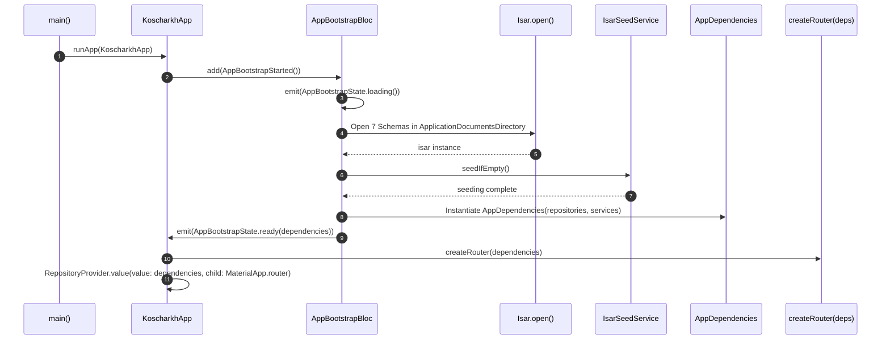

# Routing, Navigation Topology, and Dependency Injection Architecture

This document provides dense, comprehensive, agent-facing technical documentation for KosCharkh's routing topology, navigation shell architecture, typed route argument contracts, modal flow results, and dependency injection lifecycle.

This specification is normative for any AI coding agent extending, debugging, or refactoring routing, navigation, or dependency provisioning in this repository.

---

## 1. Navigation Topology: Shell vs. Pushed Modal Flows

KosCharkh implements a hybrid navigation topology built on [`GoRouter`](../../lib/src/core/routing/app_router.dart). The application segregates long-lived persistent screen hierarchies (tab branches) from transient fullscreen workflows (forms, map navigation, pickers, and previews).

```
+----------------------------------------------------------------------------------------------------+
|                                         GoRouter Root Stack                                        |
|                                                                                                    |
|  +--------------------------+                                                                      |
|  |       /splash            |  (Initial route, SplashBloc bootstrap gate)                          |
|  +--------------------------+                                                                      |
|                                                                                                    |
|  +----------------------------------------------------------------------------------------------+  |
|  |                    StatefulShellRoute.indexedStack (MainShell Scaffold)                      |  |
|  |                                                                                              |  |
|  |  +------------------------+  +------------------------+  +--------------------------------+  |  |
|  |  |   Branch 0: /home      |  |   Branch 1: /charkhs   |  |   Branch 2: /account           |  |  |
|  |  |   (HomeScreen)         |  |   (CharkhsScreen)      |  |   (AccountScreen)              |  |  |
|  |  |   [Static View]        |  |   [CharkhListCubit]    |  |   [ProfileCubit]               |  |  |
|  |  +------------------------+  +------------------------+  +--------------------------------+  |  |
|  |                                                                                              |  |
|  |  +----------------------------------------------------------------------------------------+  |  |
|  |  |                   KosBottomNav (72dp height, surfaceMuted, 3 Tab Items)                |  |  |
|  |  +----------------------------------------------------------------------------------------+  |  |
|  +----------------------------------------------------------------------------------------------+  |
|                                                                                                    |
|  +----------------------------------------------------------------------------------------------+  |
|  |                                    Pushed Fullscreen Flows                                   |  |
|  |  (Outside Shell Navigator: Hides KosBottomNav, Full Immersion, Explicit Pop/Dismissal)       |  |
|  |                                                                                              |  |
|  |  * /charkhs/new                          (CharkhFormScreen + CharkhFormCubit)                |  |
|  |  * /charkhs/:charkhStableId/edit         (CharkhFormScreen + CharkhFormCubit)                |  |
|  |  * /destination/new                      (DestinationFormScreen + DestinationFormCubit)      |  |
|  |  * /destination/:destinationStableId/edit(DestinationFormScreen + DestinationFormCubit)      |  |
|  |  * /account/destinations                 (SavedDestinationsScreen + DestinationLibraryCubit) |  |
|  |  * /destinations/select                 (SavedDestinationPickerScreen -> DestinationDraft)  |  |
|  |  * /location/select                      (SelectLocationScreen -> LocationSelection)         |  |
|  |  * /route-preview                        (RoutePreviewScreen + RouteCalculationBloc)         |  |
|  |  * /charkhs/:charkhStableId/map          (ActiveMapScreen + ActiveMapBloc)                   |  |
|  |  * /account/edit                         (EditProfileScreen + EditProfileCubit)              |  |
|  +----------------------------------------------------------------------------------------------+  |
+----------------------------------------------------------------------------------------------------+
```

### 1.1 Tab Shell Structure (`StatefulShellRoute.indexedStack`)

The main interface is hosted within a [`StatefulShellRoute.indexedStack`](../../lib/src/core/routing/app_router.dart#L42-L83). This constructs a multi-branch navigation shell maintaining separate, persistent navigation stacks across the primary application destinations:

1. **Branch 0 (`/home`)**: Presents [`HomeScreen`](../../lib/src/features/home/presentation/home_screen.dart). Static overview containing action cards, quick-start routes, and navigation entry points.
2. **Branch 1 (`/charkhs`)**: Presents [`CharkhsScreen`](../../lib/src/features/charkhs/presentation/charkhs_screen.dart), scoped with [`CharkhListCubit`](../../lib/src/features/charkhs/application/charkh_list_cubit.dart). Displays the user's saved multi-waypoint walking loops.
3. **Branch 2 (`/account`)**: Presents [`AccountScreen`](../../lib/src/features/profile/presentation/account_screen.dart), scoped with [`ProfileCubit`](../../lib/src/features/profile/application/profile_cubit.dart). Displays user telemetry, walking history stats, and profile details.

#### Tab Persistence Invariant
Because the shell uses `indexedStack`, tab branches are **never rebuilt or destroyed** when switching between tabs. Each branch retains its:
- Active scroll positions (e.g. scroll offsets in `ListView` of charkhs).
- Internal widget tree states.
- Scoped Cubits and repository subscriptions created during the route's initial visit.

#### `MainShell` and `KosBottomNav` Integration
The shell container [`MainShell`](../../lib/src/core/routing/app_router.dart#L214-L235) wraps the `StatefulNavigationShell` body with [`KosBottomNav`](../../lib/src/core/widgets/components.dart#L458-L496):

```dart
class MainShell extends StatelessWidget {
  const MainShell({super.key, required this.navigationShell});

  final StatefulNavigationShell navigationShell;

  @override
  Widget build(BuildContext context) {
    return Scaffold(
      backgroundColor: Theme.of(context).scaffoldBackgroundColor,
      body: navigationShell,
      bottomNavigationBar: KosBottomNav(
        currentIndex: navigationShell.currentIndex,
        onTap: (index) {
          navigationShell.goBranch(
            index,
            initialLocation: index == navigationShell.currentIndex,
          );
        },
      ),
    );
  }
}
```

Key characteristics:
- **Navigation Bar Height**: `KosBottomNav` enforces a fixed height of `72dp` (plus bottom `SafeArea`).
- **Color Token**: Styled with `context.colors.surfaceMuted` (`#1A1E24`).
- **Branch Switching & Re-tap Reset**: `navigationShell.goBranch(index, initialLocation: index == navigationShell.currentIndex)` ensures that tapping an inactive tab switches branches smoothly, while tapping the **already-active tab** resets that branch back to its root location.

---

### 1.2 Pushed Fullscreen Flows (Outside Shell)

Child flows in KosCharkh are intentionally declared as top-level routes **outside** the `StatefulShellRoute`. 

#### Architectural Rationale for Outside-Shell Pushing
1. **Viewport Real Estate & Immersion**:
   Interactive maps ([`ActiveMapScreen`](../../lib/src/features/routes/presentation/active_map_screen.dart)), map location selection ([`SelectLocationScreen`](../../lib/src/features/locations/presentation/select_location_screen.dart)), and multi-stop route previews ([`RoutePreviewScreen`](../../lib/src/features/routes/presentation/route_preview_screen.dart)) require full vertical screen height. Permitting the 72dp bottom navigation bar to remain visible would obstruct map controls, telemetry overlays, and bottom action sheets.
2. **Modal Flow Semantics & Clean Destruction**:
   Flows like `/charkhs/new` and `/destination/new` are discrete, transactional creation processes. Pushing them outside the shell gives them standard modal pop transitions (`context.pop()`), cleans up their scoped form cubits immediately upon disposal, and eliminates back-stack ambiguity.
3. **Hardware Back Button / Pop Scope**:
   Android predictive back and system back gestures pop the top-level route from the root `Navigator` rather than navigating between tabs in the shell.

---

### 1.3 Complete Route URL Matrix

The following table is the normative specification for all routes in KosCharkh:

| Path | Screen Class | Scoped State Manager | Arguments Contract (`extra` / `params`) | Flow Type / Return Value |
|---|---|---|---|---|
| `/splash` | [`SplashScreen`](../../lib/src/features/splash/presentation/splash_screen.dart) | [`SplashBloc`](../../lib/src/features/splash/application/splash_bloc.dart) | None | Root initial route; redirects or proceeds on bootstrap |
| `/home` | [`HomeScreen`](../../lib/src/features/home/presentation/home_screen.dart) | None (Static presentation) | None | Shell Tab Branch 0 |
| `/charkhs` | [`CharkhsScreen`](../../lib/src/features/charkhs/presentation/charkhs_screen.dart) | [`CharkhListCubit`](../../lib/src/features/charkhs/application/charkh_list_cubit.dart) | None | Shell Tab Branch 1 |
| `/account` | [`AccountScreen`](../../lib/src/features/profile/presentation/account_screen.dart) | [`ProfileCubit`](../../lib/src/features/profile/application/profile_cubit.dart) | None | Shell Tab Branch 2 |
| `/charkhs/new` | [`CharkhFormScreen`](../../lib/src/features/charkhs/presentation/charkh_form_screen.dart) | [`CharkhFormCubit`](../../lib/src/features/charkhs/application/charkh_form_cubit.dart) | None | Pushed fullscreen; modal creation flow |
| `/charkhs/:charkhStableId/edit` | [`CharkhFormScreen`](../../lib/src/features/charkhs/presentation/charkh_form_screen.dart) | [`CharkhFormCubit`](../../lib/src/features/charkhs/application/charkh_form_cubit.dart) | Path: `:charkhStableId` | Pushed fullscreen; loads existing charkh for edit |
| `/destination/new` | [`DestinationFormScreen`](../../lib/src/features/destinations/presentation/destination_form_screen.dart) | [`DestinationFormCubit`](../../lib/src/features/destinations/application/destination_form_cubit.dart) | `extra: DestinationFormArgs?` | Pushed fullscreen; returns submitted [`DestinationDraft`](../../lib/src/features/destinations/domain/destination.dart) via `context.pop(draft)` |
| `/destination/:destinationStableId/edit` | [`DestinationFormScreen`](../../lib/src/features/destinations/presentation/destination_form_screen.dart) | [`DestinationFormCubit`](../../lib/src/features/destinations/application/destination_form_cubit.dart) | `extra: DestinationFormArgs?`, Path: `:destinationStableId` | Pushed fullscreen; returns updated [`DestinationDraft`](../../lib/src/features/destinations/domain/destination.dart) via `context.pop(draft)` |
| `/account/destinations` | [`SavedDestinationsScreen`](../../lib/src/features/destinations/presentation/saved_destinations_screen.dart) | [`DestinationLibraryCubit`](../../lib/src/features/destinations/application/destination_library_cubit.dart) | None | Pushed fullscreen; displays library of saved destinations |
| `/destinations/select` | [`SavedDestinationPickerScreen`](../../lib/src/features/destinations/presentation/saved_destination_picker_screen.dart) | [`DestinationLibraryCubit`](../../lib/src/features/destinations/application/destination_library_cubit.dart) | None | Pushed modal picker; returns selected [`DestinationDraft`](../../lib/src/features/destinations/domain/destination.dart) via `context.pop(dest)` |
| `/location/select` | [`SelectLocationScreen`](../../lib/src/features/locations/presentation/select_location_screen.dart) | [`LocationPickerCubit`](../../lib/src/features/locations/application/location_picker_cubit.dart) | `extra: LocationSelection?` | Pushed modal map picker; returns [`LocationSelection`](../../lib/src/features/locations/domain/location_selection.dart) via `context.pop(selection)` |
| `/route-preview` | [`RoutePreviewScreen`](../../lib/src/features/routes/presentation/route_preview_screen.dart) | [`RouteCalculationBloc`](../../lib/src/features/routes/application/route_calculation_bloc.dart) | `extra: RoutePreviewArgs` (Mandatory) | Pushed fullscreen; computes geometry via Directions API or fallback, then launches active navigation |
| `/charkhs/:charkhStableId/map` | [`ActiveMapScreen`](../../lib/src/features/routes/presentation/active_map_screen.dart) | [`ActiveMapBloc`](../../lib/src/features/routes/application/active_route_bloc.dart) | Path: `:charkhStableId` | Pushed fullscreen; primary turn-by-turn waypoint navigation engine |
| `/account/edit` | [`EditProfileScreen`](../../lib/src/features/profile/presentation/edit_profile_screen.dart) | [`EditProfileCubit`](../../lib/src/features/profile/application/edit_profile_cubit.dart) | None | Pushed fullscreen; edits profile attributes |

---

## 2. Type-Safe Route Arguments Contract

All parameterized navigation transitions in KosCharkh must use strongly typed argument classes declared in [`lib/src/core/routing/route_args.dart`](../../lib/src/core/routing/route_args.dart).

### 2.1 Argument Classes Specification

```dart
// lib/src/core/routing/route_args.dart

class RoutePreviewArgs {
  const RoutePreviewArgs({
    required this.title,
    required this.destinations,
    required this.timeMinutes,
    this.charkhStableId,
  });

  final String title;
  final List<DestinationDraft> destinations;
  final int timeMinutes;
  final String? charkhStableId;
}

class DestinationFormArgs {
  const DestinationFormArgs({this.draft, this.canSaveToLibrary = false});

  final DestinationDraft? draft;
  final bool canSaveToLibrary;
}

class SelectLocationArgs {
  const SelectLocationArgs({this.initial});

  final LocationSelection? initial;
}
```

1. **`RoutePreviewArgs`**:
   - `title`: User-visible name of the charkh or route preview.
   - `destinations`: Non-empty ordered list of [`DestinationDraft`](../../lib/src/features/destinations/domain/destination.dart) waypoints.
   - `timeMinutes`: Target walk duration used for speed and timing calculations.
   - `charkhStableId`: Optional persistent ID. When supplied, allows `RouteCalculationBloc` to check and update [`RouteCacheRepository`](../../lib/src/features/routes/data/route_cache_repository.dart).
2. **`DestinationFormArgs`**:
   - `draft`: Optional existing waypoint data when editing an existing stop.
   - `canSaveToLibrary`: Boolean flag indicating whether the "Save to Destination Library" checkbox should be rendered and processed.
3. **`SelectLocationArgs`**:
   - `initial`: Optional starting [`LocationSelection`](../../lib/src/features/locations/domain/location_selection.dart) (coordinates + address) used to center the map picker camera.

---

### 2.2 Defensive Extraction Invariant

When reading arguments passed through `state.extra`, route builders **MUST NEVER** perform an unsafe direct cast (e.g. `state.extra as DestinationFormArgs`) without type verification and a defensive fallback.

#### The Web Refresh & Deep Link Hazard
If a user refreshes the browser in Flutter Web, or if a route is opened via an external deep link, `state.extra` will be `null`. An unvalidated cast causes a runtime `TypeError` that breaks the navigation tree.

#### Mandatory Pattern for Route Builders
Route builders must follow the pattern implemented in [`app_router.dart`](../../lib/src/core/routing/app_router.dart#L105-L107):

```dart
// ✅ CORRECT: Type verification with defensive fallback instance
GoRoute(
  path: '/destination/new',
  builder: (context, state) {
    final args = state.extra is DestinationFormArgs
        ? state.extra! as DestinationFormArgs
        : const DestinationFormArgs();

    return BlocProvider(
      create: (_) => DestinationFormCubit(
        args.draft,
        destinationLibraryRepository: dependencies.destinationLibraryRepository,
        canSaveToLibrary: args.canSaveToLibrary,
      ),
      child: const DestinationFormScreen(title: 'Create Destination'),
    );
  },
);

// ❌ INCORRECT: Unsafe direct cast throws on web reload or deep link
GoRoute(
  path: '/destination/new',
  builder: (context, state) {
    final args = state.extra as DestinationFormArgs; // CRASH if state.extra is null
    ...
  },
);
```

For routes requiring strict non-null inputs (such as `/route-preview`), the argument must be checked, and if missing, the UI must handle fallback gracefully or assert valid state before navigation.

---

### 2.3 Modal Result Contract (`context.pop(result)`)

KosCharkh uses Flutter's typed modal pop mechanism for sub-flows that return data to the calling screen:

#### 1. Location Selection Flow
Calling screen pushes `/location/select` and awaits a [`LocationSelection`](../../lib/src/features/locations/domain/location_selection.dart):
```dart
// In caller (e.g. DestinationFormScreen):
final selection = await context.push<LocationSelection>(
  '/location/select',
  extra: state.location,
);
if (selection != null && context.mounted) {
  context.read<DestinationFormCubit>().locationChanged(selection);
}

// Inside SelectLocationScreen:
KosButton(
  text: 'Confirm Location',
  onPressed: () => context.pop(state.selection),
)
```

#### 2. Saved Destination Picker Flow
Calling screen pushes `/destinations/select` and awaits a selected [`DestinationDraft`](../../lib/src/features/destinations/domain/destination.dart):
```dart
// In caller (e.g. CharkhFormScreen):
final selectedDraft = await context.push<DestinationDraft>('/destinations/select');
if (selectedDraft != null && context.mounted) {
  context.read<CharkhFormCubit>().addSavedDestination(selectedDraft);
}

// Inside SavedDestinationPickerScreen:
SavedDestinationTile(
  destination: item,
  onTap: () => context.pop(item),
)
```

#### 3. Destination Creation/Edit Flow
Pushes `/destination/new` and awaits a created [`DestinationDraft`](../../lib/src/features/destinations/domain/destination.dart):
```dart
// In caller (e.g. CharkhFormScreen):
final newDraft = await context.push<DestinationDraft>(
  '/destination/new',
  extra: const DestinationFormArgs(canSaveToLibrary: true),
);
if (newDraft != null && context.mounted) {
  context.read<CharkhFormCubit>().addDestination(newDraft);
}

// Inside DestinationFormScreen:
BlocListener<DestinationFormCubit, DestinationFormState>(
  listenWhen: (previous, current) =>
      previous.submittedDraft != current.submittedDraft &&
      current.submittedDraft != null,
  listener: (context, state) => context.pop(state.submittedDraft),
  child: ...
)
```

---

## 3. Dependency Injection Architecture

KosCharkh rejects global service locators, static singletons, and magic ambient containers. Dependency injection is achieved using an immutable dependency container ([`AppDependencies`](../../lib/src/core/di/app_dependencies.dart)) coupled with scoped `BlocProvider` instantiation inside route builders.

### 3.1 `AppDependencies` Container Structure

[`AppDependencies`](../../lib/src/core/di/app_dependencies.dart) aggregates all **10 non-nullable** repositories and platform data services:

```dart
// lib/src/core/di/app_dependencies.dart

class AppDependencies {
  const AppDependencies({
    required this.profileRepository,
    required this.charkhRepository,
    required this.destinationLibraryRepository,
    required this.routeCacheRepository,
    required this.activeRouteRepository,
    required this.charkhHistoryRepository,
    required this.directionsService,
    required this.reverseGeocodingService,
    required this.currentLocationService,
    required this.compassHeadingService,
  });

  // 6 Isar-backed persistence repositories
  final ProfileRepository profileRepository;
  final CharkhRepository charkhRepository;
  final DestinationLibraryRepository destinationLibraryRepository;
  final RouteCacheRepository routeCacheRepository;
  final ActiveRouteRepository activeRouteRepository;
  final CharkhHistoryRepository charkhHistoryRepository;

  // 4 Network, GIS, and hardware sensor services
  final DirectionsService directionsService;
  final ReverseGeocodingService reverseGeocodingService;
  final CurrentLocationService currentLocationService;
  final CompassHeadingService compassHeadingService;
}
```

---

### 3.2 Asynchronous Bootstrap and Construction Lifecycle

The container lifecycle is strictly coordinated by [`AppBootstrapBloc`](../../lib/src/core/app/app_bootstrap_bloc.dart). Repositories require an active Isar database connection and seeded baseline data before they can safely process reads or writes.



#### Code Invariant in `AppBootstrapBloc._onStarted`
```dart
// lib/src/core/app/app_bootstrap_bloc.dart
Future<void> _onStarted(
  AppBootstrapStarted event,
  Emitter<AppBootstrapState> emit,
) async {
  emit(const AppBootstrapState.loading());
  try {
    final directory = await getApplicationDocumentsDirectory();
    final isar = await Isar.open(
      [
        ProfileRecordSchema,
        CharkhRecordSchema,
        DestinationRecordSchema,
        SavedDestinationRecordSchema,
        RouteCacheRecordSchema,
        ActiveRouteRecordSchema,
        CharkhHistoryRecordSchema,
      ],
      directory: directory.path,
      inspector: false,
    );
    await IsarSeedService(isar).seedIfEmpty();
    final dependencies = AppDependencies(
      profileRepository: ProfileRepository(isar),
      charkhRepository: CharkhRepository(isar),
      destinationLibraryRepository: DestinationLibraryRepository(isar),
      routeCacheRepository: RouteCacheRepository(isar),
      activeRouteRepository: ActiveRouteRepository(isar),
      charkhHistoryRepository: CharkhHistoryRepository(isar),
      directionsService: DirectionsService(),
      reverseGeocodingService: ReverseGeocodingService(),
      currentLocationService: CurrentLocationService(),
      compassHeadingService: CompassHeadingService(),
    );
    emit(
      AppBootstrapState(
        status: AppBootstrapStatus.ready,
        dependencies: dependencies,
      ),
    );
  } catch (error) {
    emit(
      AppBootstrapState(
        status: AppBootstrapStatus.failure,
        message: error.toString(),
      ),
    );
  }
}
```

---

### 3.3 Root Provider Injection

At the root of the widget tree, [`KoscharkhApp`](../../lib/src/core/app/koscharkh_app.dart) gates router creation until bootstrap is ready. When ready, it injects `AppDependencies` down the widget tree using `RepositoryProvider.value`:

```dart
// lib/src/core/app/koscharkh_app.dart

return BlocBuilder<AppBootstrapBloc, AppBootstrapState>(
  builder: (context, state) {
    final theme = buildKoscharkhDarkTheme();
    if (state.status == AppBootstrapStatus.ready &&
        state.dependencies != null) {
      final router = createRouter(state.dependencies!);
      return RepositoryProvider.value(
        value: state.dependencies!,
        child: MaterialApp.router(
          debugShowCheckedModeBanner: false,
          title: 'KosCharkh',
          theme: theme,
          routerConfig: router,
        ),
      );
    }
    // Loading or failure fallback screen...
  },
);
```

---

### 3.4 Router Scoping Pattern for Cubits & Blocs

KosCharkh adheres to the **Router-Scoped Injection Pattern**:
1. `createRouter(AppDependencies dependencies)` receives the verified dependencies object directly at initialization.
2. Route builders act as the dependency injector, constructing Cubits and Blocs precisely when a screen route is entered.
3. Every state manager is wrapped in `BlocProvider`, guaranteeing that:
   - The state manager is created lazily or immediately upon route mount.
   - The state manager is automatically closed (`cubit.close()`) when the route is popped.
   - Presentation screens receive their dependencies via `BlocProvider` or typed constructor parameters.

```dart
// Example: Route builder instantiating and scoping a Cubit
GoRoute(
  path: '/charkhs/new',
  builder: (context, state) => BlocProvider(
    create: (_) => CharkhFormCubit(repository: dependencies.charkhRepository),
    child: const CharkhFormScreen(title: 'Create Charkh'),
  ),
),
```

#### Presentation Layer Direct Access Ban
- Presentation widgets **MUST NOT** instantiate repositories, open database handles, or invoke services directly.
- Presentation widgets **MUST NOT** query global service locators (e.g. `GetIt.I.get<...>()`).
- Presentation widgets consume state via `BlocBuilder`, `BlocConsumer`, or `context.read<MyCubit>()`.
