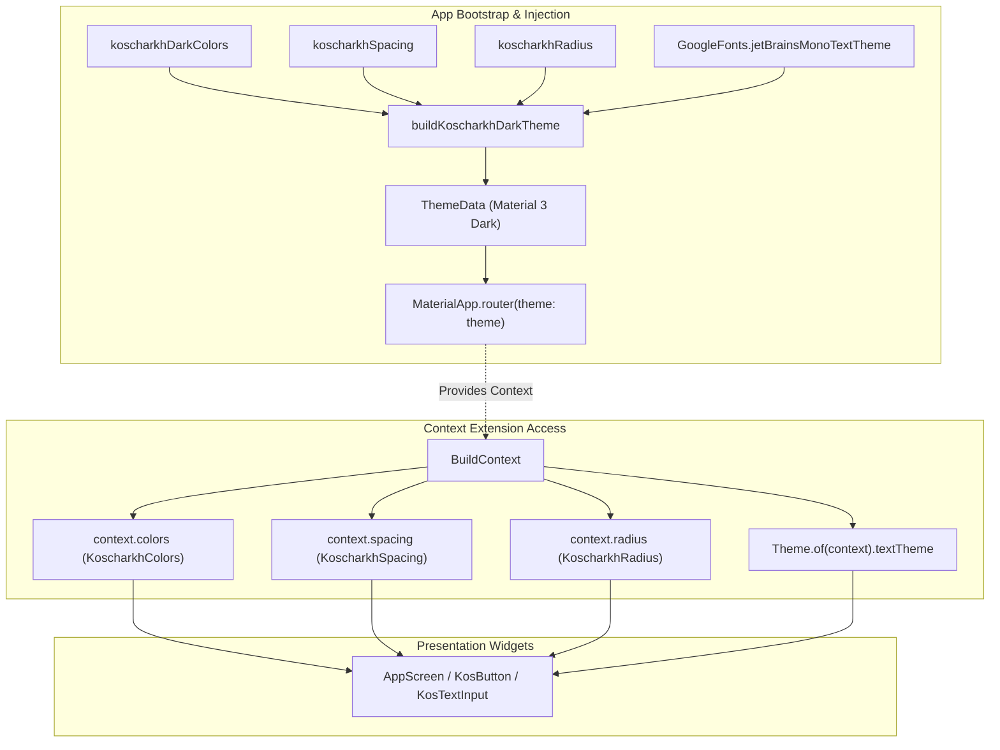

# KosCharkh UI System Architecture Overview

This document provides a comprehensive architectural breakdown of the presentation and design system layer in KosCharkh. It details the component hierarchy, the flow of theme and token resolution, layout conventions, and the registry of proprietary widgets governing application UI.

---

## 1. Architectural Philosophy & Design Signature

KosCharkh employs a specialized, industrial-minimalist aesthetic tailored for urban navigation and route tracking. Unlike standard Material 3 applications that rely on rounded surfaces, dynamic elevation shadows, and generic typography, KosCharkh enforces a strict, opinionated visual contract:

- **Monospace-First Typography**: All UI copy, metrics, and navigation directives are rendered exclusively using **JetBrains Mono** via `GoogleFonts.jetBrainsMonoTextTheme`.
- **Zero-Radius Geometry**: Core interactive controls (`KosButton`, `KosTextInput`, `IconSquareButton`, cards, and panels) enforce `BorderRadius.zero`. Sharp, clean rectangular lines replace standard rounded corners.
- **Dark-Mode Only & Flat Tonal Elevation**: KosCharkh operates on a pure dark palette (`#15171C` base surface). Depth is communicated through tonal background shifts (`surface` -> `surfaceMuted` `#20232A` -> `border` `#343943`), rather than drop shadows or Material elevation overlays.
- **High-Contrast Emerald Accent**: High-visibility mint/emerald greens (`primary` `#34D399`, `green500` `#10B981`) serve as primary action cues and active route indicators against dark background surfaces.

```
+-----------------------------------------------------------------------+
| AppScreen (Scaffold: surface #15171C, padding: 24dp, SafeArea)        |
|                                                                       |
|  +-----------------------------------------------------------------+  |
|  | HeaderWithBack (44x44 Back Action + JetBrains Mono titleLarge)  |  |
|  +-----------------------------------------------------------------+  |
|                                                                       |
|  +-----------------------------------------------------------------+  |
|  | FieldLabel (JetBrains Mono labelLarge, 8dp bottom inset)        |  |
|  | KosTextInput (51dp height, surfaceMuted #20232A, no border)     |  |
|  | ErrorCaption (JetBrains Mono bodySmall, error #FF8D93)          |  |
|  +-----------------------------------------------------------------+  |
|                                                                       |
|  +-----------------------------------------------------------------+  |
|  | KosButton (51dp height, BorderRadius.zero, primary variant)     |  |
|  +-----------------------------------------------------------------+  |
|                                                                       |
+-----------------------------------------------------------------------+
```

---

## 2. UI Layer Topology & Directory Organization

The UI layer is partitioned into core infrastructural components and feature-specific presentation modules:

```
lib/
├── main.dart
└── src/
    ├── core/
    │   ├── app/
    │   │   ├── app_bootstrap_bloc.dart       # App lifecycle bootstrap state
    │   │   └── koscharkh_app.dart            # MaterialApp.router & root theme injector
    │   ├── map/
    │   │   └── kos_map.dart                  # High-performance map canvas & marker overlays
    │   ├── routing/
    │   │   ├── app_router.dart               # GoRouter configuration & MainShell
    │   │   └── route_args.dart               # Type-safe navigation argument transfer
    │   ├── theme/
    │   │   └── koscharkh_theme.dart          # Token definitions, extensions & ThemeData builder
    │   └── widgets/
    │       ├── app_feedback.dart             # Feedback notifications & snackbars
    │       └── components.dart               # Canonical proprietary UI primitives
    └── features/
        ├── charkhs/presentation/             # Charkh list, form, and thumbnail widgets
        ├── destinations/presentation/        # Destination creation, library, and picker
        ├── home/presentation/                # Main dashboard home shell
        ├── locations/presentation/           # Map location selector & bottom detail drawer
        ├── profile/presentation/             # Account view, edit profile, and charkh history
        ├── routes/presentation/              # Active turn-by-turn map navigation & preview
        └── splash/presentation/              # Bootstrapping splash view
```

### Architectural Boundaries
1. **`lib/src/core/theme/`**: The definitive authority for all design tokens (colors, radii, spacing, typography). Presentation widgets must never define raw color literals or hardcode font properties.
2. **`lib/src/core/widgets/`**: Standard building blocks. Feature screens consume these components rather than raw Flutter Material widgets.
3. **`lib/src/core/map/`**: Encapsulates `flutter_map` rendering, marker geometry, canvas drawing (`CustomPainter`), and vector polylines.
4. **`lib/src/features/**/presentation/`**: Feature-level screens, sub-views, and bloc listeners. Strictly prohibited from declaring ad-hoc button styles, raw text fields, or non-token styling.

---

## 3. Core Component Catalog & Location Matrix

The following table documents the proprietary UI components and the standard Flutter widgets they supersede:

| Component | Source Path | Supersedes | Role & Implementation Contract |
|---|---|---|---|
| `AppScreen` | [`lib/src/core/widgets/components.dart`](../../lib/src/core/widgets/components.dart#L50-L70) | `Scaffold`, `SafeArea`, `Padding` | Universal screen shell. Configures `scaffoldBackgroundColor` from `context.colors.surface`, wraps body in `SafeArea` (toggleable), and enforces default `EdgeInsets.symmetric(horizontal: 24)`. |
| `HeaderWithBack` | [`lib/src/core/widgets/components.dart`](../../lib/src/core/widgets/components.dart#L72-L102) | `AppBar` | Standardized header. Features a 44x44dp hit-target back button (`KosAssets.arrowBack`), vertical padding (top: 28dp, bottom: 20dp), and title in `textTheme.titleLarge`. |
| `KosButton` | [`lib/src/core/widgets/components.dart`](../../lib/src/core/widgets/components.dart#L106-L170) | `ElevatedButton`, `FilledButton`, `OutlinedButton`, `TextButton` | Universal action button. Default height 51dp (customizable to 34dp for inline card actions, 56dp for CTAs), `BorderRadius.zero`, full-width or sized. Supports `KosButtonVariant` (`primary`, `secondary`, `danger`). |
| `IconSquareButton` | [`lib/src/core/widgets/components.dart`](../../lib/src/core/widgets/components.dart#L172-L205) | `IconButton`, `FloatingActionButton` | 51x51dp square action button with `Material` + `InkWell`. Zero border radius. Used for inline shortcuts (e.g. AI suggestion lightning bolt, GPS re-center). |
| `KosTextInput` | [`lib/src/core/widgets/components.dart`](../../lib/src/core/widgets/components.dart#L207-L280) | `TextField`, `TextFormField` | Single-line form input. Fixed height 51dp, `surfaceMuted` background, no borders (`InputBorder.none`), `primary` cursor, `bodyMedium` text style, internal controller/focus node lifecycle handling. |
| `FieldLabel` | [`lib/src/core/widgets/components.dart`](../../lib/src/core/widgets/components.dart#L282-L294) | `Text` | Standard form field label. Renders in `textTheme.labelLarge` with 8dp bottom padding. Precedes every `KosTextInput`. |
| `ErrorCaption` | [`lib/src/core/widgets/components.dart`](../../lib/src/core/widgets/components.dart#L296-L316) | Inline error text | Displays field and form-level validation errors. Renders `bodySmall` styled with `context.colors.error`. Auto-collapses to `SizedBox.shrink()` when message is null or empty. |
| `KosBottomNav` | [`lib/src/core/widgets/components.dart`](../../lib/src/core/widgets/components.dart#L458-L496) | `NavigationBar`, `BottomNavigationBar` | Fixed-height (72dp) bottom navigation bar integrated with `StatefulShellRoute`. Displays `KosAssets.home`, `KosAssets.explore`, and `KosAssets.account` icons with active/muted color tinting. |
| `KosSvgIcon` | [`lib/src/core/widgets/components.dart`](../../lib/src/core/widgets/components.dart#L30-L48) | `SvgPicture.asset`, `Icon` | Standard vector icon renderer. Enforces asset resolution from `KosAssets`, size constraints (default 24dp), and `BlendMode.srcIn` color filtering. |
| `KosAssets` | [`lib/src/core/widgets/components.dart`](../../lib/src/core/widgets/components.dart#L8-L28) | String asset paths | Centralized constants repository mapping SVG assets in `design_files/Icons/`. |
| `CharkhCard` | [`lib/src/core/widgets/components.dart`](../../lib/src/core/widgets/components.dart#L318-L377) | `Card`, `ListTile` | Canonical card widget for charkh items. Renders name, duration, description, and action button bar (Start [77x34 primary], Edit [77x34 secondary], Delete [87x34 danger]). |
| `DestinationCard` | [`lib/src/core/widgets/components.dart`](../../lib/src/core/widgets/components.dart#L393-L456) | `ListTile` | 56dp fixed-height row card for destinations with inline Edit button and circular Delete icon button. |
| `confirmDestructiveAction` | [`lib/src/core/widgets/components.dart`](../../lib/src/core/widgets/components.dart#L498-L527) | `showDialog` + `AlertDialog` | Asynchronous modal dialog helper for delete and reset confirmations. Renders `surfaceMuted` dialog with cancellation and `error`-colored confirmation. |
| `KosMap` | [`lib/src/core/map/kos_map.dart`](../../lib/src/core/map/kos_map.dart#L15-L181) | Raw `FlutterMap` | Dedicated map renderer. Features `DarkMapBackdropPainter` fallback grid, emerald vector polyline rendering (`green500` @ 0.92 alpha, strokeWidth 7), dynamic marker layers, and camera controller bindings. |

---

## 4. Theme & Token Resolution Flow

KosCharkh exposes design tokens via `ThemeExtension<T>` attached to the root `ThemeData`. This ensures hot-reload stability, testability, and type-safe access across the widget hierarchy.

### Resolution Architecture



### Token Extensions Breakdown

#### 1. `KoscharkhColors`
Exposed via `context.colors`. Fallback: `koscharkhDarkColors`.
- **Semantic Tokens**:
  - `primary` (`0xFF34D399`): Primary interactive surfaces, active toggles, cursor.
  - `onPrimary` (`0xFF064E3B`): Foreground text/icons placed on `primary` surfaces.
  - `surface` (`0xFF15171C`): Base screen canvas and scaffold background.
  - `surfaceMuted` (`0xFF20232A`): Container backgrounds, text fields, cards, and bottom nav.
  - `onSurface` (`0xFFF2F4F8`): Primary content text, headers, and active icons.
  - `onSurfaceMuted` (`0xFFA8AFBC`): Secondary text, field placeholders, inactive icons.
  - `border` (`0xFF343943`): Structural division lines and non-intrusive container borders.
  - `error` (`0xFFFF8D93`): Validation error text, badges, and warning accents.
  - `onError` (`0xFF4A080D`): Contrast text/icon color on destructive surfaces.
  - `success` (`0xFF6EE7B7`): Route completion and positive indicators.
  - `warning` (`0xFFFFBF66`): Route deviation warnings and non-fatal alerts.
  - `disabled` (`0xFF2C3038`): Inactive container background.
  - `onDisabled` (`0xFF747B88`): Inactive content foreground.
  - `scrim` (`0x99000000`): Modal barriers and map marker drop shadows.
- **Palette Primitives**:
  - `green300`, `green400`, `green500`, `green900`
  - `neutral100`, `neutral400`, `neutral700`, `neutral900`, `blackSurface`
  - `red300`, `red500`, `red950`
  - `amber300`

#### 2. `KoscharkhSpacing`
Exposed via `context.spacing`. Fallback: `koscharkhSpacing`.
- `xs`: 4.0dp
- `sm`: 8.0dp
- `md`: 12.0dp
- `lg`: 16.0dp
- `xl`: 24.0dp (Standard horizontal screen margin)
- `xxl`: 32.0dp

#### 3. `KoscharkhRadius`
Exposed via `context.radius`. Fallback: `koscharkhRadius`.
- `sm`: 8.0dp
- `md`: 12.0dp
- `lg`: 16.0dp
- `pill`: 999.0dp
- *Governance Rule*: Primary buttons and form fields enforce zero radius (`BorderRadius.zero`). `KoscharkhRadius` is strictly scoped to rounded auxiliary widgets (e.g. Circular delete buttons, map point markers, status pills).

#### 4. Typography Scale
Exposed via `Theme.of(context).textTheme`. All styles utilize `GoogleFonts.jetBrainsMono`:
- `titleLarge`: 20sp, weight 500, height 1.3
- `bodyLarge`: 16sp, weight 400, height 1.45
- `bodyMedium`: 16sp, weight 400, height 1.45 (Standard text input and content style)
- `labelLarge`: 15sp, weight 500, height 1.2 (Button text and form field labels)
- `bodySmall`: 12sp, weight 400, height 1.35 (Card descriptions, timestamps, error captions)

---

## 5. Screen Layout & Composition Patterns

The codebase establishes three distinct structural patterns for screen presentation:

### Pattern A: Standard Form & Content Screen
Used by [`CharkhFormScreen`](../../lib/src/features/charkhs/presentation/charkh_form_screen.dart), [`DestinationFormScreen`](../../lib/src/features/destinations/presentation/destination_form_screen.dart), and [`EditProfileScreen`](../../lib/src/features/profile/presentation/edit_profile_screen.dart).

```dart
AppScreen(
  child: ListView(
    padding: EdgeInsets.zero,
    children: [
      HeaderWithBack(title: 'Screen Title'),
      const FieldLabel('Label Text'),
      KosTextInput(
        value: state.value,
        placeholder: 'eg. Placeholder text',
        onChanged: cubit.valueChanged,
      ),
      const SizedBox(height: 16),
      // Additional form fields...
      ErrorCaption(state.errorMessage),
      const SizedBox(height: 14),
      KosButton(
        text: 'Submit',
        onPressed: cubit.submit,
      ),
      const SizedBox(height: 28),
    ],
  ),
);
```

### Pattern B: Root Dashboard / Tab Screen
Used by [`CharkhsScreen`](../../lib/src/features/charkhs/presentation/charkhs_screen.dart) and [`AccountScreen`](../../lib/src/features/profile/presentation/account_screen.dart).

- Root structure wrapped in `SafeArea` with custom top padding (`padding: EdgeInsets.fromLTRB(24, 44, 24, 0)`).
- Scroll view with bottom padding (`padding: EdgeInsets.only(bottom: 96)`) to clear the fixed bottom navigation bar (`KosBottomNav`, 72dp) or floating action controls.
- Primary floating action button positioned at bottom-right (`Positioned(right: 0, bottom: 22, child: KosButton(text: '+ Add', width: 140, height: 56))`).

### Pattern C: Full-Bleed Map View with Bottom Drawer
Used by [`ActiveMapScreen`](../../lib/src/features/routes/presentation/active_map_screen.dart) and [`SelectLocationScreen`](../../lib/src/features/locations/presentation/select_location_screen.dart).

- Raw `Scaffold(backgroundColor: context.colors.surface)`.
- `Stack(fit: StackFit.expand)` containing:
  1. Base: Full-screen `KosMap` widget.
  2. Overlay Controls: `Positioned` floating buttons (e.g. 51x51dp `IconSquareButton` for camera re-centering).
  3. Bottom Drawer / Sheet: Bottom-docked `Container` or `AnimatedSize` panel styled with `context.colors.surface`, horizontal padding 24dp, dynamic bottom safe-area insets (`MediaQuery.paddingOf(context).bottom`).
